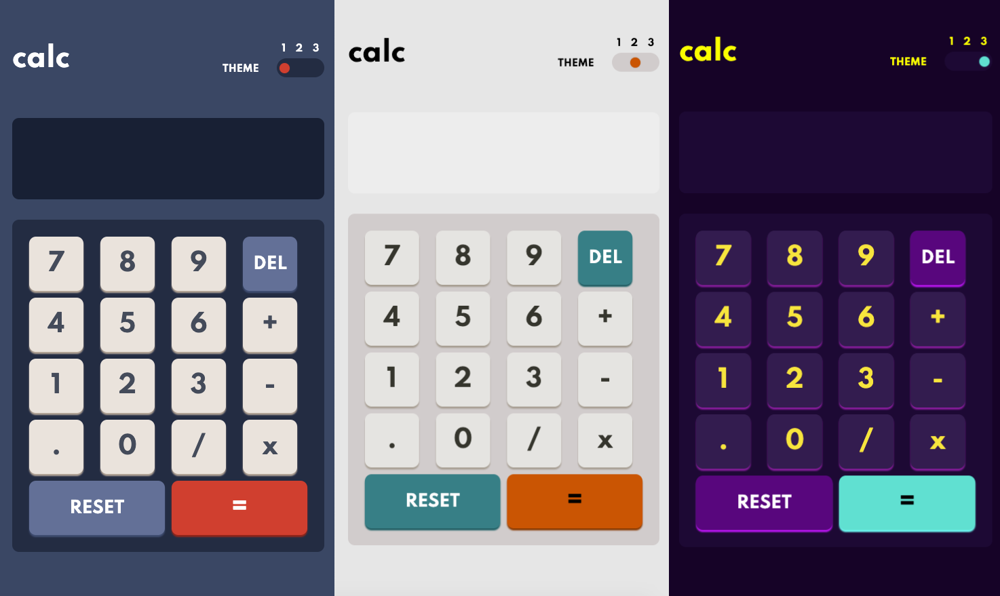

This is a solution to the [Calculator app challenge on Frontend Mentor](https://www.frontendmentor.io/challenges/calculator-app-9lteq5N29).
They gave me design for the project and style guide (colors, typography).

## Table of contents

- [Overview](#overview)
  - [The challenge](#the-challenge)
  - [Screenshot](#screenshot)
  - [Links](#links)
- [My process](#my-process)
  - [Built with](#built-with)
  - [What I learned](#what-i-learned)
  - [Continued development](#continued-development)
  - [Useful resources](#useful-resources)
- [Author](#author)

**Note: Delete this note and update the table of contents based on what sections you keep.**

## Overview

### The challenge

Users should be able to:

- Perform mathmatical operations like addition, subtraction, multiplication, and division
- Adjust the color theme based on their preference

### Screenshot



### Links

- Live Site URL: [Add live site URL here](https://calculator-app-pawelboguta.netlify.app/)

## My process

### Built with

- Semantic HTML5 markup
- CSS custom properties
- Flexbox
- CSS Grid
- JS ES6+

### What I learned

This was my first time using themes. For sure this has given me opportunity to practice that and soon if needed implementing a dark mode on a page will be a piece of cake :D. I was provided with the colors below from Frontend Mentor file. I created 3 themes like shown below... and then I created function toggle to enable user to change themes.

```css
[data-theme="3"] {
  /* THEME 3 TEXT */
  --text-clr: hsl(52, 100%, 62%);
  /* THEME 3 COLORS */
  --clr-bg-main: hsl(268, 75%, 9%);
  --clr-bg-toggle: hsl(268, 71%, 12%);
  --clr-bg-screen: hsl(268, 71%, 12%);
  --clr-kb-1: hsl(281, 89%, 26%);
  --clr-ks-1: hsl(285, 91%, 52%);
  --clr-kb-2: hsl(176, 100%, 44%);
  --clr-ks-2: hsl(177, 92%, 70%);
  --clr-kb-3: hsl(268, 47%, 21%);
  --clr-ks-3: hsl(290, 70%, 36%);
}
```

Also suprisingly I found out about switch (I have been using mostly if statements) and in this particular project it turned to be very useful.

```js
switch (operator) {
  case "+":
    calc = prevCalc + currCalc;
    break;
  // etc
}
```

Lastly, I had a problem with decimals, I came up with dealing with showing last 2 decimals rounded, but the problem was toFixed(2) was showing also 2.00 etc. I read about that and found that it returns a string and I just did parseFloat on it again.

```js
a = parseFloat(calc.toFixed(2));
```

### Continued development

I'm not happy with everything. I want to practice and improve in structuring js file. I feel like it's not structured perfectly and in the best order. This was my first that big (as for me) project and it was not easy to structure my js file well. I guess it might be time to start learning design patterns. Secondly, I tried to use BEM methodology at least in the beginning of the project just for the sake of practice, I'm going to try and implement it more and better than now.

### Useful resources

- [blog.logrocket](https://blog.logrocket.com/a-guide-to-theming-in-css/) - Before doing themes, I really felt lost, tried to find a good article, unsuccessfully until I had found this gem and everything became clear. Definitely recommend :)

- [FreeCodeCamp](https://www.freecodecamp.org/news/javascript-switch-case-js-switch-statement-example/) - Helped me to acquire basic understanding of Switch Statement.

## Author

- Twitter - [@pawelboguta](https://www.twitter.com/pawelboguta)
